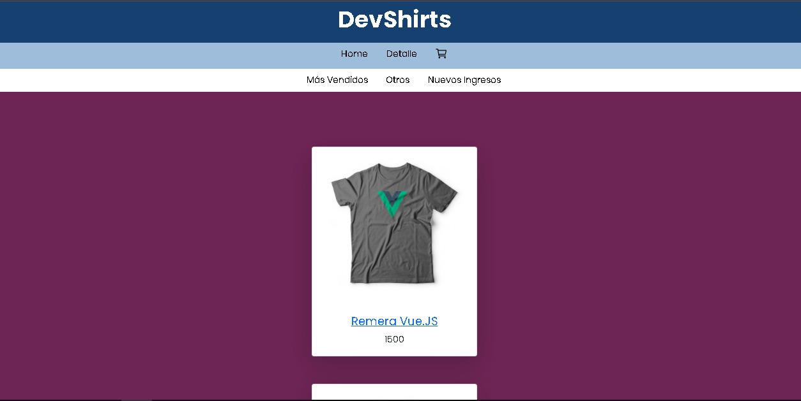
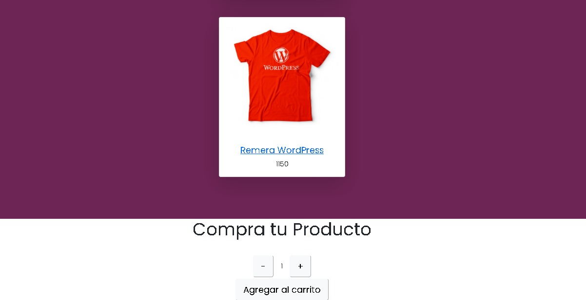
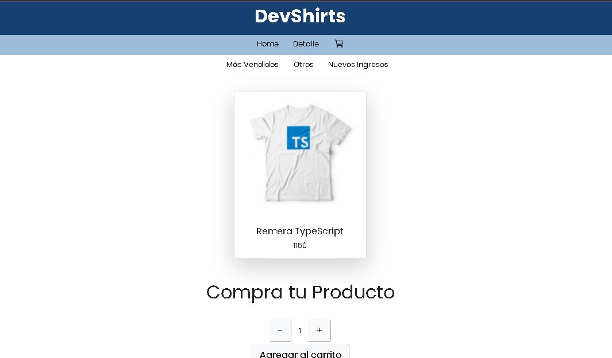

  E-commerce Gauna

# DevShirts

E-commerce desarrollado en React, para comercializar remeras estampatas con lenguajes de la industria IT.

---

## Funcionalidad del proyecto

Esta web muestra los productos a la venta. Los usuarios pueden clickear en el producto y ver los detalles individuales del mismo y un apartado de categorias donde los productos estan ordenados categoricamente.

---

## Imágenes de la web

  Index

    
        

    
        

---

  Detalles

    
        

---

** Navegabilidad / Componentes**

> - [x] Manejo de imágenes.
> - [x] camelCase para eventos.
> - [x] PascalCase para componentes.
> - [x] Routes y Links para navegaciones.
> - [x] Navbar con carrito implementado.
> - [x] Promises y Hooks.
